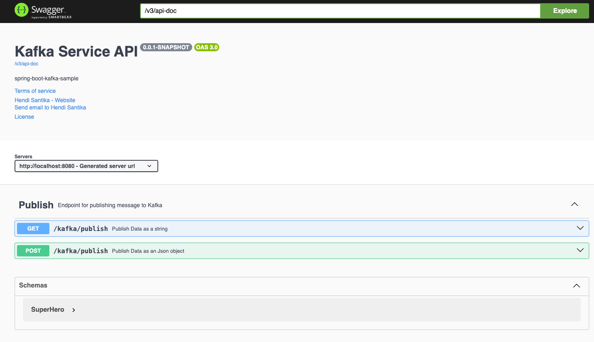
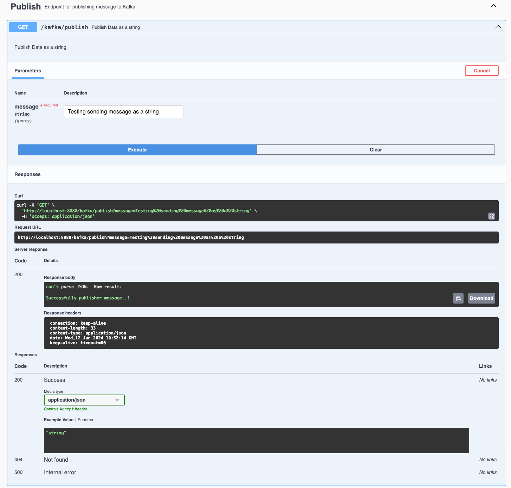
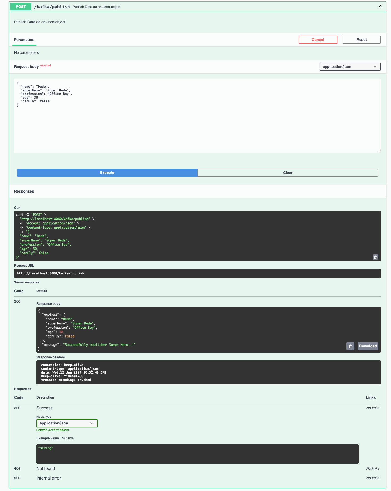
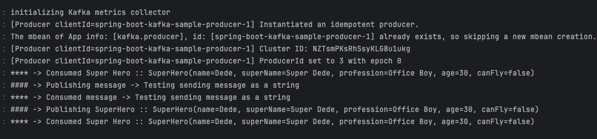

# spring-boot-kafka-sample

Spring boot kafka application with multiple Producers and multiple Consumers for String data and JSON object - This
project explains How to publish message in kafka Topic and consume a message from Kafka Topic. Here message is in String
and Json Object format.
In this application there are two publishers, i.e. one for String data and another one is for publishing object. For
those two publishers, two KafkaTemplates are used.
To consume those messages and objects two consumers are used. Two `@KafkaListners` are used to consume respective data.
### Things todo list

1. Clone this repository: `git clone https://github.com/hendisantika/spring-boot-kafka-sample.git`
2. Navigate to the folder: `cd spring-boot-kafka-sample`
3. Run your ZooKeeper & Kafka Clusters
4. Run the application: `mvn clean spring-boot:run`
5. Open your favorite browser: http://localhost:8080/swagger-ui

### API Endpoints

> **GET Mapping** http://localhost:8080/kafka/publish?message=test message

> **POST Mapping** http://localhost:8080/kafka/publish

Request Body

  ```
    {
        "name": "Tony Stark",
        "superName": "Iron Man",
        "profession": "Business",
        "age": 50,
        "canFly": true
    }
  ```

### Image Screenshots

Swagger UI Page



Send message as a string



Send message as an JSON



Console Log


